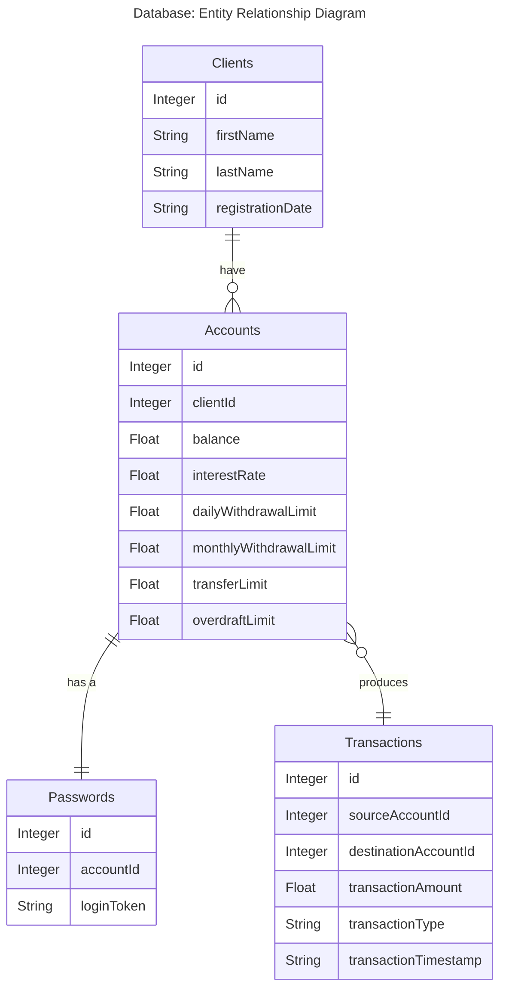

# Description
Criando um Banco Digital com Java e Orientação a Objetos.

> Um banco oferece aos seus clientes dois tipos de contas (corrente e poupança), as quais possuem as funcionalidades de depósito, saque e transferência (entre contas da própria instituição).

# Design

A dummy implementation of a database layer using something like a Repository Pattern. The classes implementing [IRepository](./src/repository/IRepository.java) could have been designed to use Entity Classes that represent entries in each table. Those Entity Classes would be constructed using Data Access Objects and JPA. Instead, [DummyRepository](./src/repository/DummyRepository.java) was used.

# Readings
| Description | Recommendation (1-5) |
| :---        | :---                 |
| [Using an Interface vs. Abstract Class in Java](https://www.baeldung.com/java-interface-vs-abstract-class) | 3 |
| [Interface vs Base class](https://stackoverflow.com/a/56894/16969525) | 4 |
| [Why to use Interfaces, Multiple Inheritance vs Interfaces, Benefits of Interfaces?](https://stackoverflow.com/a/8531493/16969525) | 4 |
| [Design Patterns for Data Access Layer](https://stackoverflow.com/a/27724421/16969525) | 5 |
| [Design patterns for the database layer](https://medium.com/towards-polyglot-architecture/design-patterns-for-the-database-layer-7b741b126036) | 3 |
| [The DAO Pattern in Java](https://www.baeldung.com/java-dao-pattern) | 5 |
