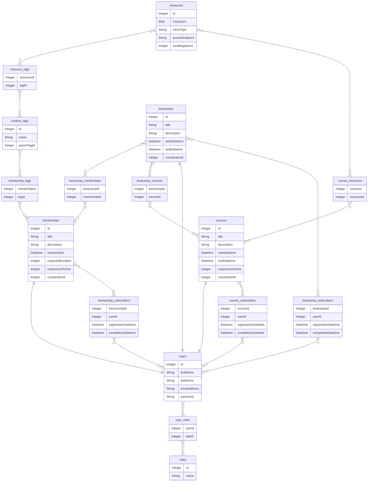
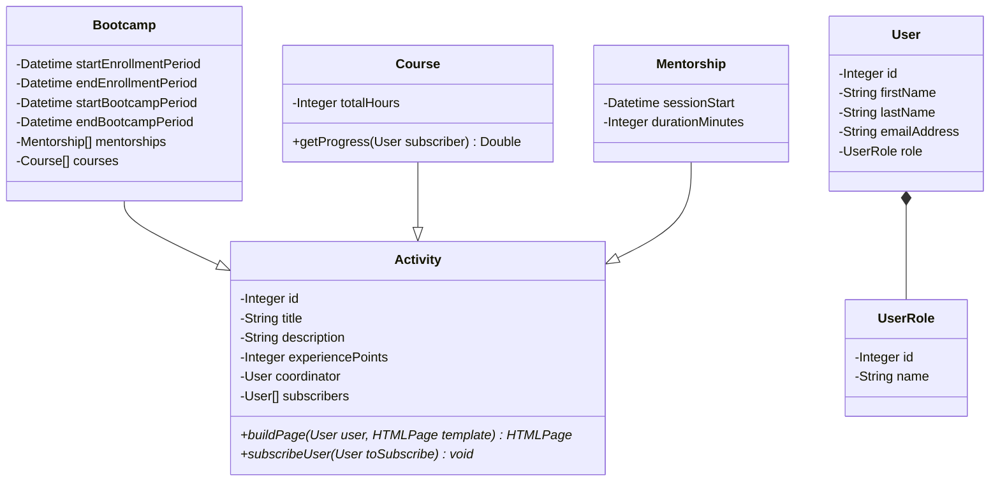

# Description
Abstraindo um Bootcamp Usando Orientação a Objetos em Java.

Just planning. No implementation.

# Entity Relationship Diagram

**Notes:**
- For simplicity, courses, mentorships, and bootcamps will each have only one coordinator (If not, three more many-to-many tables would be needed);
- `resources` table has references to a content delivery network;
- `content_tags` entries build a tree of tags used to categorize the contents covered in mentorships, courses, and bootcamps. Bootcamp tags will be inherited from the courses and mentorships it wraps;
- `user_roles` and `roles` are the base of the application access control. I think `Student`, `Instructor`, `Editor`, and `Admin` are good roles for the domain. `Editor` and `Instructor` will have to work together to build new contents: `Editor` and `Instructor` get together to plan the syllabus, `Editor` builds the new content and upload it into the platform, and after creation the `Instructor` have access to a series of infomations and metrics to accompany `Student`s subscriptions, engagement, and progress;
- I have no idea how permissions are implemented in practice. This planning only states that RBAC is used.

# Class Diagram

**Notes:**
- Getters and setters are left out;
- Authentication helper classes (like in [lab-oop-2](../lab-oop-2)) are left out;
- Authorization helper classes (If any is necessary) are left out (I don't know yet how RBAC is implemented);
- *Italic* methods are abstract.

# Resources
| Description | Recommendation (1-5) |
| :---        | :---                 |
| [Introduction to the Java 8 Date/Time API](https://www.baeldung.com/java-8-date-time-intro) | 4 |
| [User Role and Permission Management: Designing Efficient Models](https://frontegg.com/guides/user-role-and-permission) | 3 |
| [Spring Boot Security - Users & Roles](https://youtu.be/L8M_eXV0OVk?si=_YRR0bfFZYrk9z9i) | 5 |
| [Designing Role-Based Access Control](https://medium.com/@kamalmeet/designing-role-based-access-control-63c17a32894) | 5 |
| [Implementing Role Based Security in a Web App](https://medium.com/bluecore-engineering/implementing-role-based-security-in-a-web-app-89b66d1410e4) | 5 |
| [Overview of access control](https://cloud.google.com/storage/docs/access-control) |  |
