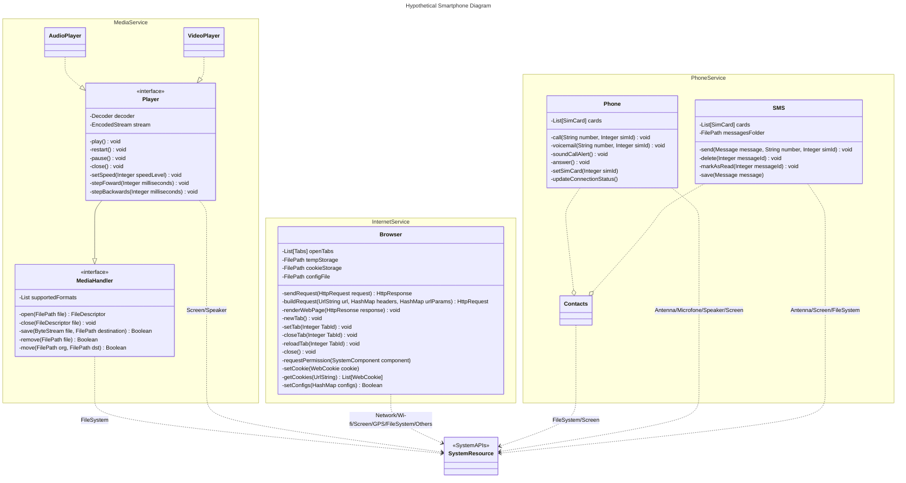

# Description
Modelando o iPhone com UML: Funções de Músicas, Chamadas e Internet.

Cool! I just found out about [Mermaid](https://mermaid.js.org/).

I have zero experience with iPhones, so I used my "understanding" of Android devices to build the diagram.

# Hypothetical class diagram for smartphones
There is no mention of an application manager, and access to system resources is loosely commented.

